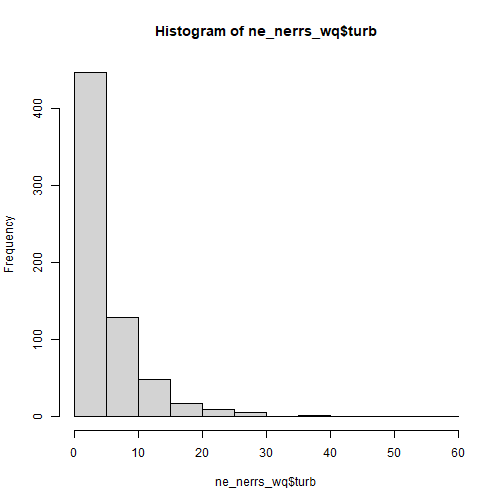
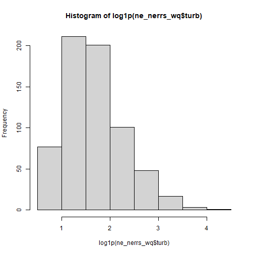
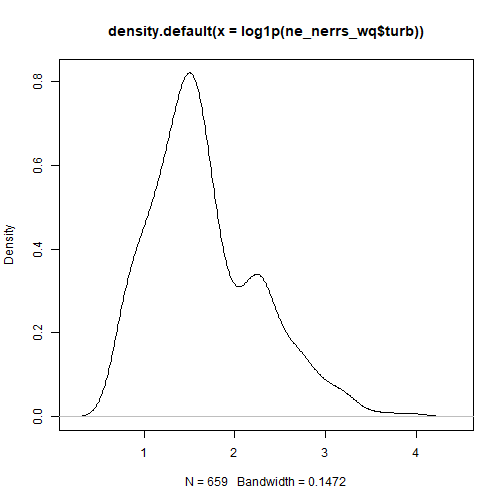
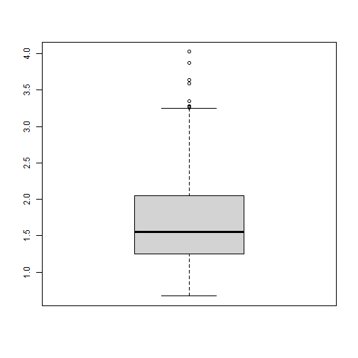

# Introduction
This lesson will cover calculating basic statistics with R, conducting statistical tests, and building simple linear models.  We will use the 2007 NLA data for the examples.

## Get Data
First step in any project will be getting the data read into R.  For this lesson we are using the 2007 National Lakes Assessment data, which ,luckily, we already have locally.  From our `nla_analysis.R` script we can re-run a bunch of that code.  I've copied over the important bits here.  Alternatively, you can just open up your `nla_analysis.R` and run everything in there.  


```r
library(dplyr)
library(readr)
library(tidyr)

nla_wq_all <- read_csv("nla2007_chemical_conditionestimates_20091123.csv")

nla_wq <- nla_wq_all %>%
  rename_all(tolower) %>% #making all names lower case beucase they are a mess!
  mutate_if(is.character, tolower) %>%
  filter(site_type == "prob_lake",
         visit_no == 1) %>%
  select(site_id, st, epa_reg, wsa_eco9, ptl, ntl, turb, chla, doc)
```


Next, lets get a bit more info from the NLA Sites and join that to our data.


```r
nla_sites <- read_csv("https://www.epa.gov/sites/production/files/2014-01/nla2007_sampledlakeinformation_20091113.csv")
```

```
## Parsed with column specification:
## cols(
##   .default = col_character(),
##   VISIT_NO = col_double(),
##   LON_DD = col_double(),
##   LAT_DD = col_double(),
##   ALBERS_X = col_double(),
##   ALBERS_Y = col_double(),
##   FLD_LON_DD = col_double(),
##   FLD_LAT_DD = col_double(),
##   MDCATY = col_double(),
##   WGT = col_double(),
##   WGT_NLA = col_double(),
##   ECO_LEV_3 = col_double(),
##   AREA_HA = col_double(),
##   LAKEAREA = col_double(),
##   LAKEPERIM = col_double(),
##   SLD = col_double(),
##   DEPTH_X = col_double(),
##   DEPTHMAX = col_double(),
##   ELEV_PT = col_double(),
##   COM_ID = col_double(),
##   VISIT_ID = col_double()
##   # ... with 1 more columns
## )
```

```
## See spec(...) for full column specifications.
```

```r
nla_sites <- nla_sites %>%
  filter(VISIT_NO == 1) %>%
  select(SITE_ID, STATE_NAME, CNTYNAME, LAKE_ORIGIN, RT_NLA) %>%
  rename_all(tolower) %>% #making all names lower case because they are a mess!
  mutate_if(is.character, tolower)

nla <- left_join(nla_sites, nla_wq, by = "site_id") %>%
  filter(!is.na(ntl),
         !is.na(chla),
         !is.na(ptl))
```


So now we have our dataset ready for analysis.

## Analyze Data

### Basic Stats
First step in analyzing a dataset like this is going to be to dig through some basic statistics as well as some basic plots.  

We can get a summary of the full data frame:


```r
#Get a summary of the data frame
summary(nla)
```

```
##    site_id           state_name          cntyname         lake_origin           rt_nla               st           
##  Length:1028        Length:1028        Length:1028        Length:1028        Length:1028        Length:1028       
##  Class :character   Class :character   Class :character   Class :character   Class :character   Class :character  
##  Mode  :character   Mode  :character   Mode  :character   Mode  :character   Mode  :character   Mode  :character  
##                                                                                                                   
##                                                                                                                   
##                                                                                                                   
##    epa_reg            wsa_eco9              ptl              ntl               turb              chla       
##  Length:1028        Length:1028        Min.   :   1.0   Min.   :    5.0   Min.   :  0.237   Min.   :  0.07  
##  Class :character   Class :character   1st Qu.:  11.0   1st Qu.:  325.5   1st Qu.:  1.520   1st Qu.:  2.98  
##  Mode  :character   Mode  :character   Median :  29.0   Median :  586.5   Median :  3.815   Median :  7.79  
##                                        Mean   : 110.5   Mean   : 1179.2   Mean   : 13.620   Mean   : 29.63  
##                                        3rd Qu.:  94.5   3rd Qu.: 1210.8   3rd Qu.: 11.200   3rd Qu.: 25.96  
##                                        Max.   :4679.0   Max.   :26100.0   Max.   :574.000   Max.   :936.00  
##       doc         
##  Min.   :  0.340  
##  1st Qu.:  3.380  
##  Median :  5.575  
##  Mean   :  8.863  
##  3rd Qu.:  8.925  
##  Max.   :290.570
```

Or, we can pick and choose what stats we want.  For instance:


```r
#Stats for Total Nitrogen
mean(nla$ntl)
```

```
## [1] 1179.23
```

```r
median(nla$ntl)
```

```
## [1] 586.5
```

```r
min(nla$ntl)
```

```
## [1] 5
```

```r
max(nla$ntl)
```

```
## [1] 26100
```

```r
sd(nla$ntl)
```

```
## [1] 2086.885
```

```r
IQR(nla$ntl)
```

```
## [1] 885.25
```

```r
range(nla$ntl)
```

```
## [1]     5 26100
```

### Some quick useful viz

While visualization isn't the point of this lesson, some things are useful to do at this stage of analysis.  In particular is looking at distributions and some basic scatterplots.

We can look at histograms and density:


```r
#A single histogram using base
hist(nla$ntl)
```



```r
#Log transform it
hist(log1p(nla$ntl)) #log1p adds one to deal with zeros
```



```r
#Density plot
plot(density(log1p(nla$ntl)))
```




And boxplots:


```r
#Simple boxplots
boxplot(nla$chla)
```


```r
boxplot(log1p(nla$chla))
```



```r
#Boxplots per group
boxplot(log1p(nla$chla)~nla$epa_reg)
```


And scatterplots:


```r
#A single scatterplot
plot(log1p(nla$ptl),log1p(nla$chla))
```


And we can do a matrix of scatterplots from a data frame, but we should be careful as non-numeric columns won't log transform and many columns will make for a very uninformative matrix!  So lets subset our dataframe and plot that.


```r
# Subset with dplyr::select
nla_numeric_columns <- nla %>%
  select(ntl, ptl, chla, turb)

#A matrix of scatterplot
plot(log1p(nla_numeric_columns))
```


## Some tests: t-test and ANOVA
There are way more tests than we can show examples for.  For today we will show two very common and straightforward tests.  The t-test and an ANOVA.

### t-test
First we will look at the t-test to test and see if `lake_orign` shows a difference in `chla`.  In other words can we expect a difference in clarity due to whether a lake is man-made or natural.  This is a two-tailed test. There are two approaches for this 1) using the formula notation if your dataset is in a "long" format or 2) using two separate vectors if your dataset is in a "wide" format.


```r
#Long Format - original format for lake_origin and chla
t.test(nla$chla ~ nla$lake_origin)
```

```
## 
## 	Welch Two Sample t-test
## 
## data:  nla$chla by nla$lake_origin
## t = -2.5178, df = 588.31, p-value = 0.01207
## alternative hypothesis: true difference in means is not equal to 0
## 95 percent confidence interval:
##  -21.428307  -2.647756
## sample estimates:
## mean in group man-made  mean in group natural 
##               24.48944               36.52747
```

```r
#Wide Format - need to do some work to get there - tidyr is handy!
wide_nla <- nla %>%
  select(site_id, chla, lake_origin) %>%
  spread(lake_origin, chla)
names(wide_nla)<-c("site_id","man_made", "natural")
t.test(wide_nla$man_made, wide_nla$natural)
```

```
## 
## 	Welch Two Sample t-test
## 
## data:  wide_nla$man_made and wide_nla$natural
## t = -2.5178, df = 588.31, p-value = 0.01207
## alternative hypothesis: true difference in means is not equal to 0
## 95 percent confidence interval:
##  -21.428307  -2.647756
## sample estimates:
## mean of x mean of y 
##  24.48944  36.52747
```

Same results, two different ways to approach.  Take a look at the help (e.g. `?t.test`) for more details on other types of t-tests (e.g. paired, one-tailed, etc.)

### ANOVA
ANOVA can get involved quickly and I haven't done them since my last stats class, so I'm not the best to talk about these, but the very basics require fitting a model and wrapping that ins `aov` function.  In the [Getting More Help section](#getting-more-help) I provide a link that would be a good first start for you ANOVA junkies.  For todays lesson though, lets look at the simple case of a one-vay analysis of variance and check if reference class results in differences in our chlorophyll


```r
# A quick visual of this:
boxplot(log1p(nla$chla)~nla$rt_nla)
```


```r
# One way analysis of variance
nla_anova <- aov(log1p(chla)~rt_nla, data=nla)
nla_anova #Terms
```

```
## Call:
##    aov(formula = log1p(chla) ~ rt_nla, data = nla)
## 
## Terms:
##                    rt_nla Residuals
## Sum of Squares   165.4115 1597.0869
## Deg. of Freedom         2      1025
## 
## Residual standard error: 1.248252
## Estimated effects may be unbalanced
```

```r
summary(nla_anova) #The table
```

```
##               Df Sum Sq Mean Sq F value Pr(>F)    
## rt_nla         2  165.4   82.71   53.08 <2e-16 ***
## Residuals   1025 1597.1    1.56                   
## ---
## Signif. codes:  0 '***' 0.001 '**' 0.01 '*' 0.05 '.' 0.1 ' ' 1
```

```r
anova(nla_anova) #The table with a bit more
```

```
## Analysis of Variance Table
## 
## Response: log1p(chla)
##             Df  Sum Sq Mean Sq F value    Pr(>F)    
## rt_nla       2  165.41  82.706   53.08 < 2.2e-16 ***
## Residuals 1025 1597.09   1.558                      
## ---
## Signif. codes:  0 '***' 0.001 '**' 0.01 '*' 0.05 '.' 0.1 ' ' 1
```


## Correlations and Linear modeling
The last bit of basic stats we will cover is going to be linear relationships.

### Correlations
Let's first take a look at correlations.  These can be done with `cor()`.


```r
#For a pair
cor(log1p(nla$ptl),log1p(nla$ntl))
```

```
## [1] 0.8044302
```

```r
#For a correlation matrix
cor(log1p(nla_numeric_columns))
```

```
##            ntl       ptl      chla      turb
## ntl  1.0000000 0.8044302 0.7155305 0.6832722
## ptl  0.8044302 1.0000000 0.7132769 0.7933675
## chla 0.7155305 0.7132769 1.0000000 0.7254511
## turb 0.6832722 0.7933675 0.7254511 1.0000000
```

```r
#Spearman Rank Correlations
cor(log1p(nla_numeric_columns),method = "spearman")
```

```
##            ntl       ptl      chla      turb
## ntl  1.0000000 0.8156020 0.7030997 0.7077893
## ptl  0.8156020 1.0000000 0.7473225 0.8283843
## chla 0.7030997 0.7473225 1.0000000 0.7897786
## turb 0.7077893 0.8283843 0.7897786 1.0000000
```

You can also test for differences using:


```r
cor.test(log1p(nla$ptl),log1p(nla$ntl))
```

```
## 
## 	Pearson's product-moment correlation
## 
## data:  log1p(nla$ptl) and log1p(nla$ntl)
## t = 43.375, df = 1026, p-value < 2.2e-16
## alternative hypothesis: true correlation is not equal to 0
## 95 percent confidence interval:
##  0.7817373 0.8249955
## sample estimates:
##       cor 
## 0.8044302
```

### Linear models
Basic linear models in R can be built with the `lm()` function.  If you aren't building standard least squares regressin models, (e.g. logistic) or aren't doing linear models then you will need to look elsewhere (e.g `glm()`, or `nls()`).  For today our focus is going to be on simple linear models.  Let's look at our ability to model chlorophyll, given the other variables we have.


```r
# The simplest case
chla_tp <- lm(log1p(chla) ~ log1p(ptl), data=nla) #Creates the model
summary(chla_tp) #Basic Summary
```

```
## 
## Call:
## lm(formula = log1p(chla) ~ log1p(ptl), data = nla)
## 
## Residuals:
##     Min      1Q  Median      3Q     Max 
## -5.1358 -0.4810 -0.0091  0.5749  2.7828 
## 
## Coefficients:
##             Estimate Std. Error t value Pr(>|t|)    
## (Intercept)  0.17974    0.07445   2.414   0.0159 *  
## log1p(ptl)   0.63363    0.01944  32.598   <2e-16 ***
## ---
## Signif. codes:  0 '***' 0.001 '**' 0.01 '*' 0.05 '.' 0.1 ' ' 1
## 
## Residual standard error: 0.9186 on 1026 degrees of freedom
## Multiple R-squared:  0.5088,	Adjusted R-squared:  0.5083 
## F-statistic:  1063 on 1 and 1026 DF,  p-value: < 2.2e-16
```

```r
names(chla_tp) #The bits
```

```
##  [1] "coefficients"  "residuals"     "effects"       "rank"          "fitted.values" "assign"        "qr"           
##  [8] "df.residual"   "xlevels"       "call"          "terms"         "model"
```

```r
chla_tp$coefficients #My preference
```

```
## (Intercept)  log1p(ptl) 
##   0.1797429   0.6336289
```

```r
coef(chla_tp) #Same thing, but from a function
```

```
## (Intercept)  log1p(ptl) 
##   0.1797429   0.6336289
```

```r
resid(chla_tp) # The residuals
```

```
##            1            2            3            4            5            6            7            8 
## -1.197616404 -0.890810064  0.310632312 -0.322657888 -0.406536743  0.127974131 -0.339407602  0.597741740 
##            9           10           11           12           13           14           15           16 
## -0.016430236 -1.620567258  0.521617697 -1.178643606 -0.113580581  1.226329546 -2.801468058  0.700269818 
##           17           18           19           20           21           22           23           24 
## -0.306449565 -0.475244893  1.359626277 -0.866209488  1.148038251 -0.561050897 -0.558791930  0.231390742 
##           25           26           27           28           29           30           31           32 
##  0.303802604  0.473821980  0.012330787 -0.770264263  0.219131943  0.681999289  0.333207658  0.837813121 
##           33           34           35           36           37           38           39           40 
## -1.175729371 -0.375561135 -0.352459971  1.245037090 -0.573848002 -2.210292458 -2.013191415 -0.167865371 
##           41           42           43           44           45           46           47           48 
## -0.485736219  0.048888383 -0.387701994  1.295957132 -1.042656295 -5.135798274  0.255540718  1.036477782 
##           49           50           51           52           53           54           55           56 
## -0.897473109  0.009431088  0.981287264 -0.130470617 -1.115024047 -2.386592164  0.848151190  0.064101449 
##           57           58           59           60           61           62           63           64 
## -0.075287557  1.348174257  0.310038814 -0.088312739  0.169516370  0.552235700 -0.662631754  0.141825723 
##           65           66           67           68           69           70           71           72 
## -0.786121582  0.036541377  1.373140794  0.099982920 -0.460638133 -0.927829912 -2.562620672 -0.095774787 
##           73           74           75           76           77           78           79           80 
##  1.313481002 -0.143509629 -2.553667039 -0.957379017  0.164883222 -0.532164246 -0.251739859 -0.212270793 
##           81           82           83           84           85           86           87           88 
##  0.210521811  0.532133182  1.804047750 -0.638675511  0.274592940 -0.920636682 -0.160163846  0.246426326 
##           89           90           91           92           93           94           95           96 
## -0.313767389  0.001099233  1.205708026 -0.554252924  1.333263076 -0.625881185  2.178433214  0.330190161 
##           97           98           99          100          101          102          103          104 
## -1.135994579 -0.679969824  1.515741002 -0.030232555  0.298845056 -0.274852948  0.108971214 -0.602551598 
##          105          106          107          108          109          110          111          112 
##  0.658975383 -0.545627296  0.574612747  0.627682898 -0.220449921  0.564076030 -0.155249873  0.137180990 
##          113          114          115          116          117          118          119          120 
## -0.795774796 -1.241530103  0.412947599  0.212854474 -0.470352395 -0.047961443  1.002199289  0.121924408 
##          121          122          123          124          125          126          127          128 
##  0.791414435  0.027183033 -0.253387221  0.106996112  1.098067422 -1.248116252  1.510433797  1.567930781 
##          129          130          131          132          133          134          135          136 
##  2.300381909  0.985681896  0.496089298  0.526329221 -0.837851435 -0.568257481  0.358103222 -1.356275715 
##          137          138          139          140          141          142          143          144 
##  0.326527045 -0.141238047  0.602783859 -1.142627977 -0.116055311 -1.170261637 -0.764239618 -0.590217717 
##          145          146          147          148          149          150          151          152 
## -0.755585748 -0.460600245  0.009374949 -0.456788384  0.493192664  0.258609346  0.468040685  0.035942213 
##          153          154          155          156          157          158          159          160 
##  0.146526852 -0.350930800 -0.752188031  0.054482770  0.337564959 -1.814229711 -0.405413830 -0.568541677 
##          161          162          163          164          165          166          167          168 
##  1.193876804  0.116799649  0.670181113 -0.029060467  0.125588431  0.284898525 -0.145672102 -1.798913546 
##          169          170          171          172          173          174          175          176 
## -0.321531149  0.775083756  0.587029817 -1.753730134  0.340946257 -0.480983939  0.367852435  1.489149269 
##          177          178          179          180          181          182          183          184 
## -0.049634422  0.555318601  0.558260667  0.123175096 -0.273843610 -0.377016419  1.179086419 -0.499688648 
##          185          186          187          188          189          190          191          192 
##  2.204024320  1.795265026 -1.109988509  0.252619317 -0.138131188 -1.395725941 -0.014162725 -1.805602472 
##          193          194          195          196          197          198          199          200 
##  0.195313188 -0.356079621  0.633850554  0.543096087 -0.213454984  0.869097732 -0.186882371  1.289382240 
##          201          202          203          204          205          206          207          208 
## -0.005546360  0.048095452  0.265388539  0.476196321  0.494601463  0.252626003  1.382084156  0.389016930 
##          209          210          211          212          213          214          215          216 
## -0.549433637 -0.100147197  0.245500293  1.207810875 -1.200472397 -1.383265845 -1.486416853 -1.034411361 
##          217          218          219          220          221          222          223          224 
## -0.772960118 -0.765491997  1.594882039 -0.381750009  1.143462484  0.854380752 -0.258811878  0.282639016 
##          225          226          227          228          229          230          231          232 
## -0.397527673 -3.352116794 -0.038915340  1.556072666 -0.492848637 -0.415086666 -0.481846131 -0.796512868 
##          233          234          235          236          237          238          239          240 
##  0.100799702 -0.344039900 -0.511520336  0.238001374  0.621111604  1.343813486 -1.614994467 -2.248785376 
##          241          242          243          244          245          246          247          248 
## -0.140803600  0.123978331 -0.265146545 -0.290403326 -0.374409356 -0.976120812 -0.539864186  0.927095515 
##          249          250          251          252          253          254          255          256 
##  0.259208240  0.033462028  0.477299462  0.682319422 -1.077271621 -0.284075687 -0.651685110 -0.344441220 
##          257          258          259          260          261          262          263          264 
##  0.057331346  0.902516069 -0.055092096 -0.133880159  0.377385463  1.339596706  0.518241212  0.085118123 
##          265          266          267          268          269          270          271          272 
##  0.129185443  0.411978825  2.044624374 -0.735404211 -3.730091487 -1.390589445  0.719518473  0.509275552 
##          273          274          275          276          277          278          279          280 
## -0.924147769 -0.127210039  1.481114016 -0.391800297 -0.397527673  0.860594041 -0.642965508 -0.242249150 
##          281          282          283          284          285          286          287          288 
##  0.083701308 -1.931216766  0.712235896  0.474573703 -0.285765536  0.735847520 -0.270859521 -1.181859784 
##          289          290          291          292          293          294          295          296 
##  0.017583463 -0.548280725  0.922980237  0.053121488 -0.506223954 -0.708320163 -0.564495884  0.218306535 
##          297          298          299          300          301          302          303          304 
##  0.160293509  0.322648992  0.095404276  0.345072173 -1.184025199 -0.513797731  0.139063918  0.763318336 
##          305          306          307          308          309          310          311          312 
## -0.133796576 -0.303116201 -1.528676829 -0.662381726 -0.496965440 -1.011338680  1.569201847 -1.873334728 
##          313          314          315          316          317          318          319          320 
##  0.455097561 -2.085842294  0.603338659  1.259204517  0.526505129  0.977339183  0.069193649  0.008269120 
##          321          322          323          324          325          326          327          328 
##  0.898956954 -0.016675728  0.790173699  1.588889635  0.164140589  0.367265049 -0.774460667 -0.906100536 
##          329          330          331          332          333          334          335          336 
## -1.297297949  0.219782011 -0.123621551 -0.288549758  0.608837882  0.930545452 -0.136514841 -0.321550798 
##          337          338          339          340          341          342          343          344 
## -1.338846952 -0.285493837  0.963593860  1.176333305 -0.228972404 -0.008895207  0.616364349  0.481613487 
##          345          346          347          348          349          350          351          352 
## -0.104012962 -0.126586842  0.831227195  0.150991104  0.492366850 -0.563637373 -0.801877450 -0.210991310 
##          353          354          355          356          357          358          359          360 
##  1.126386904 -0.426202808  1.362539444  0.633821979 -1.326509310  0.584712042 -0.355041549 -0.073423963 
##          361          362          363          364          365          366          367          368 
## -0.468651150  0.721449444 -0.148072952 -1.578302037 -0.664082431 -0.211984481  0.498471217 -0.299367908 
##          369          370          371          372          373          374          375          376 
## -0.170737164 -1.367059762  1.053411892 -0.005334372 -0.063566165 -0.494458756 -0.522777490  0.315597975 
##          377          378          379          380          381          382          383          384 
##  1.765546925 -2.958741787 -0.518426183 -0.046452619 -0.324698742 -0.259961233 -0.496437052  1.367202294 
##          385          386          387          388          389          390          391          392 
## -0.655330779 -0.965285649 -0.551840377 -0.064887287  0.635133244  1.485938467  0.019503704  0.911453715 
##          393          394          395          396          397          398          399          400 
##  0.345847185 -0.292671218  0.130174924  1.423428688  1.316788851  2.202364283  1.184110357  0.465833723 
##          401          402          403          404          405          406          407          408 
##  0.182049896  1.020862884  0.819890620 -0.256674243 -0.107360255 -1.008687601 -0.231771964  0.507705442 
##          409          410          411          412          413          414          415          416 
## -0.043384121 -0.481055241  0.087657867  0.809051653 -0.674282399 -0.335433077 -0.562994098 -0.216048153 
##          417          418          419          420          421          422          423          424 
## -0.058501105 -1.498575058  0.123322373 -0.782621464  1.104981684 -0.463134613  1.249244596  0.253962501 
##          425          426          427          428          429          430          431          432 
##  0.822198510  0.959791409 -0.372407533 -0.188243565  0.682355547  0.340247212  1.053617928  0.747879252 
##          433          434          435          436          437          438          439          440 
## -0.366620135 -0.036725370  0.009315156 -1.375032223  0.877552547 -0.911918595 -0.299402267  0.974523816 
##          441          442          443          444          445          446          447          448 
##  1.279177323  0.425412713 -0.884002930 -0.417002480 -0.027219246  0.243121352  0.109178978 -1.106909194 
##          449          450          451          452          453          454          455          456 
## -0.234738327  0.265343180  0.570095053  1.332971639  0.622256282 -0.053306784 -2.178738631  1.561665053 
##          457          458          459          460          461          462          463          464 
## -1.014123656 -0.923822620  0.383820581 -0.009235935  0.653803441 -0.083922242  0.463987581  0.263773803 
##          465          466          467          468          469          470          471          472 
## -1.584264377 -0.993005566 -0.094919139  0.172529911  0.178787270 -0.948458606  0.138797192  0.166697569 
##          473          474          475          476          477          478          479          480 
##  1.066726726 -0.976417085 -0.014625023 -0.208464234 -0.870566793  0.543781698 -0.970647102  0.018346451 
##          481          482          483          484          485          486          487          488 
##  1.523087756 -0.998493037  0.547203646  0.084156521 -0.295311107 -0.731700817 -0.955634471 -0.366620135 
##          489          490          491          492          493          494          495          496 
## -1.082338734 -0.551282341  0.513908565  0.123937695  0.674927803 -0.194852074 -0.124165897 -0.880301075 
##          497          498          499          500          501          502          503          504 
##  0.414469214 -1.108208375 -0.369394601 -0.421395835  0.212163241 -0.219537165 -0.537259046 -1.764016920 
##          505          506          507          508          509          510          511          512 
##  0.546123540 -0.437562572  0.668193509 -1.589352293 -0.213712464 -1.304450454  0.983150391 -0.287798187 
##          513          514          515          516          517          518          519          520 
##  0.323960897  0.330432777  1.138455098  1.451143506  0.526876178 -0.193673255  0.240983674 -0.429766982 
##          521          522          523          524          525          526          527          528 
## -0.283238526 -0.381945616 -3.181131493 -0.232194975  0.640271868 -0.186795239 -0.027363539 -0.780818923 
##          529          530          531          532          533          534          535          536 
##  0.665237200 -0.445124428  0.443936431  1.267988864  0.239132889 -0.320624594  0.753718172 -0.041913415 
##          537          538          539          540          541          542          543          544 
## -0.223130161  2.148050987  0.645674710  0.203383890 -0.499402343  1.866534173 -2.046797133  0.246368117 
##          545          546          547          548          549          550          551          552 
## -0.597362970  1.302714941 -0.395519658  1.483795059  0.110784684 -0.479179048 -0.031154325  0.305291205 
##          553          554          555          556          557          558          559          560 
##  1.390276344 -1.212562363 -0.765469446  0.138219953  1.610329834 -0.353055811 -0.373942731 -0.859018055 
##          561          562          563          564          565          566          567          568 
## -0.422750116  0.174157916 -0.210991310  1.707429429 -0.068127147 -1.128301947 -0.448125965  0.751606468 
##          569          570          571          572          573          574          575          576 
##  0.337207558  0.509540404 -0.212241655 -0.387829583 -0.808677774 -1.133700802  0.295688441 -0.859402451 
##          577          578          579          580          581          582          583          584 
## -0.366360877 -0.133495599  0.371564047  1.353750182  0.125370673 -0.193344714 -0.420759663  0.150940030 
##          585          586          587          588          589          590          591          592 
## -0.629240121  0.231515021 -0.187721120 -0.574746198 -0.834995509  0.161591526 -0.165870874 -0.142815617 
##          593          594          595          596          597          598          599          600 
##  0.012624591  0.146526852 -0.028579436 -0.615220588  0.186765103  0.124889699  0.628123159  0.650853454 
##          601          602          603          604          605          606          607          608 
##  2.575348764  2.782760375 -0.024954577  1.854042546 -0.584415298  0.913160323  0.544049031  0.598112568 
##          609          610          611          612          613          614          615          616 
## -0.346743647  1.331802040  0.099285401 -0.629884114 -0.501488563  1.459732097 -0.144935038 -1.018732471 
##          617          618          619          620          621          622          623          624 
##  0.293194665  0.587912425  0.777002752  0.628644453  0.402477114  0.233036833  0.089647952 -0.946234674 
##          625          626          627          628          629          630          631          632 
##  0.421335722  1.232743942  0.076956576  0.280855241 -0.393274978  1.028318697  0.964649698  0.670355245 
##          633          634          635          636          637          638          639          640 
##  1.512079969 -0.833477455 -0.297852150 -0.249936087  0.441505460  0.667763188  0.293903420 -3.855912697 
##          641          642          643          644          645          646          647          648 
##  0.787738451  0.456617326 -0.981023755  0.365688826  1.751849592 -0.134818521 -0.398023876 -0.075747975 
##          649          650          651          652          653          654          655          656 
## -0.415627714  0.995394044 -0.531151918  0.823941336  0.078225940 -0.007572652 -0.056720882 -0.363395586 
##          657          658          659          660          661          662          663          664 
## -2.271845254 -0.359542016  0.422399119  1.481805098 -0.755212712  1.157333750 -1.233498802 -1.534367313 
##          665          666          667          668          669          670          671          672 
## -0.323156861 -0.207988131 -0.111042769  0.863865936 -1.853345954  1.513747010 -0.240528356 -0.303249576 
##          673          674          675          676          677          678          679          680 
##  0.092432968 -0.001610298 -0.477805937  0.983705600  0.119829084  0.261861259 -0.359980232  0.402151051 
##          681          682          683          684          685          686          687          688 
##  0.427027154  1.145744461  1.066531849 -0.001897477  1.560050548  0.338712620  0.765503343  0.325457626 
##          689          690          691          692          693          694          695          696 
##  0.972507176  1.217142228  0.269089178 -0.946029432 -0.811241679  0.653325412  0.150997302  0.976731135 
##          697          698          699          700          701          702          703          704 
## -0.050981852  0.788654338 -0.266363302  1.431422819 -0.036640800  1.310610096 -0.422334707  1.671848054 
##          705          706          707          708          709          710          711          712 
##  0.429440458 -0.402063743 -0.509314006  1.790558751  0.204695283  0.142649388 -1.226801964 -0.118105272 
##          713          714          715          716          717          718          719          720 
## -0.329255377 -0.364871450 -0.339401361 -2.307338409 -0.622915894 -0.045277772 -0.327937887 -1.903900374 
##          721          722          723          724          725          726          727          728 
## -0.202240170 -0.469033811  0.323303732 -0.727109091  0.626561763  1.022350296 -0.470027784  0.659057915 
##          729          730          731          732          733          734          735          736 
## -0.659362940  0.235296305 -0.092345283 -0.185635614 -0.048184765  1.350841487  0.895851602  1.180302198 
##          737          738          739          740          741          742          743          744 
##  0.662679025 -0.647628559  2.187773624 -1.277977695 -0.903914888 -2.102542290  0.119550032  0.103131909 
##          745          746          747          748          749          750          751          752 
##  1.244231358 -1.221930091  1.726768798 -0.778713824  1.002394481 -0.415086666  0.667533036  0.447551807 
##          753          754          755          756          757          758          759          760 
## -0.223191130 -0.190686044  0.785902973 -0.254555341 -0.603767988 -0.778722284 -0.666826614  0.852477799 
##          761          762          763          764          765          766          767          768 
## -0.572464726  0.905206495  0.546559387 -0.303475408  0.029105187 -0.315609935 -0.121093105 -1.255820904 
##          769          770          771          772          773          774          775          776 
## -0.253665017  1.719196690 -0.175159980 -0.387196409  0.657100044 -0.652673952 -0.495467471 -0.062611241 
##          777          778          779          780          781          782          783          784 
##  0.403126937  0.358288213  0.083898444 -1.153666497  0.643081639 -1.205713614  0.148398867 -1.594807435 
##          785          786          787          788          789          790          791          792 
##  0.112862574  0.966173618  0.288377317  1.810024642  0.936208863  2.683622115 -1.250399220 -0.586157470 
##          793          794          795          796          797          798          799          800 
## -0.156114700  1.151351158 -1.896956423  0.230772312 -0.887037834 -0.306578702  0.949790828 -0.212763001 
##          801          802          803          804          805          806          807          808 
## -0.115681130 -0.133495599 -0.008741538 -0.426867283  1.715134510 -3.489212101  1.300017238  2.518521375 
##          809          810          811          812          813          814          815          816 
##  1.358623414  0.961398342 -0.324854993  0.483491771  1.526484973 -0.022574121 -0.486579450 -0.690021801 
##          817          818          819          820          821          822          823          824 
##  0.254453414 -0.170784889 -0.083698626  0.262625763 -0.018684876  0.519291136  0.235474338 -0.348069615 
##          825          826          827          828          829          830          831          832 
##  0.225352803  1.127345096 -0.204874852  0.057517715  0.604661844 -0.111702252 -0.142856191 -0.108328425 
##          833          834          835          836          837          838          839          840 
## -0.978543337  1.594939550  0.521929751  0.239228713 -0.869691880  1.087755693  0.496069187  0.701858199 
##          841          842          843          844          845          846          847          848 
## -0.240421985 -2.812818495  0.191989226  1.107229086 -1.991804595  1.738975014 -0.075287557  1.067984934 
##          849          850          851          852          853          854          855          856 
##  0.164268412  0.095933512 -0.240504554 -0.750757711  0.854169950  0.757754547 -1.728215750 -2.096161228 
##          857          858          859          860          861          862          863          864 
## -0.764239618 -1.036430637  0.661252376 -1.467474710  0.447206152 -1.015232794  0.382907010 -1.186294984 
##          865          866          867          868          869          870          871          872 
## -1.192618493 -0.389146913  0.870291278 -0.257003918 -0.551321458  0.007454227  1.505446223 -0.388670452 
##          873          874          875          876          877          878          879          880 
##  1.531765919 -0.730223506  0.508537232 -1.059126090 -0.066002439 -0.450228286  2.081613182 -0.431285921 
##          881          882          883          884          885          886          887          888 
##  0.330470936  1.722981129  1.230283025 -0.230371508  0.768583978 -0.491652728  0.651661179  0.357513405 
##          889          890          891          892          893          894          895          896 
##  1.161339150  0.624179451 -1.287303490 -1.226083734  0.864933699  1.580694196  0.358718743  0.874122069 
##          897          898          899          900          901          902          903          904 
##  0.774360404 -0.171204324  0.566929452  0.877212800  0.683469871  0.281220360 -0.582279545 -1.233023411 
##          905          906          907          908          909          910          911          912 
## -0.186845694 -0.287876575  0.661245337 -0.958209078 -0.459486476 -0.306361309  0.654835954 -0.882605348 
##          913          914          915          916          917          918          919          920 
## -1.223623281  0.427093256 -0.344574703 -1.175142363  0.007124826 -0.008937546  0.381494854 -0.856220066 
##          921          922          923          924          925          926          927          928 
## -1.105535468  1.322958859 -0.540290508  0.367507505 -0.954174152 -0.921201362  0.781230594 -0.635141499 
##          929          930          931          932          933          934          935          936 
## -0.400353097 -2.541054565 -0.416285174 -2.038116839 -0.429516129 -0.464938385 -1.354954370 -1.799895412 
##          937          938          939          940          941          942          943          944 
##  0.599425410  0.262187913  1.231560213  0.197873551 -0.067388308  1.344725044  0.013938663  0.053211806 
##          945          946          947          948          949          950          951          952 
##  1.120638421  0.493944946 -1.200221544  0.616988657 -1.531770249  0.299973300  1.659965531 -0.743363234 
##          953          954          955          956          957          958          959          960 
## -2.052433653 -0.264776869  0.831782460  0.156749916  0.013107875  0.737592844 -0.718524930 -0.535728585 
##          961          962          963          964          965          966          967          968 
## -0.708435197 -0.495619484 -0.887311240  0.230948255 -0.192406532 -1.114058765 -0.527539240 -0.411040230 
##          969          970          971          972          973          974          975          976 
##  0.855861327 -0.295991983  0.506775802 -0.573765738 -1.334738143  0.017635839 -3.190505253  0.532166291 
##          977          978          979          980          981          982          983          984 
## -0.844611900  0.761080799  0.451253437  0.762383722  1.095739212  0.448936112 -0.398639678  0.761907674 
##          985          986          987          988          989          990          991          992 
## -0.050418147 -0.003868449  0.374840768  0.130524111  1.035497850  0.297349742 -0.405696926  1.960286761 
##          993          994          995          996          997          998          999         1000 
##  0.880488364 -0.643302182 -0.478489810  0.623150583 -0.381272956 -0.024646382 -0.151556102  0.662002400 
##  [ reached getOption("max.print") -- omitted 28 entries ]
```

We can also do multiple linear regression.


```r
chla_tp_tn_turb <- lm(log1p(chla) ~ log1p(ptl) + log1p(ntl) + log1p(turb), data = nla)
summary(chla_tp_tn_turb)
```

```
## 
## Call:
## lm(formula = log1p(chla) ~ log1p(ptl) + log1p(ntl) + log1p(turb), 
##     data = nla)
## 
## Residuals:
##     Min      1Q  Median      3Q     Max 
## -4.7115 -0.4347  0.0188  0.5247  2.2272 
## 
## Coefficients:
##             Estimate Std. Error t value Pr(>|t|)    
## (Intercept) -1.60380    0.19192  -8.357  < 2e-16 ***
## log1p(ptl)   0.10869    0.03480   3.123  0.00184 ** 
## log1p(ntl)   0.43622    0.04045  10.783  < 2e-16 ***
## log1p(turb)  0.45109    0.03708  12.167  < 2e-16 ***
## ---
## Signif. codes:  0 '***' 0.001 '**' 0.01 '*' 0.05 '.' 0.1 ' ' 1
## 
## Residual standard error: 0.8081 on 1024 degrees of freedom
## Multiple R-squared:  0.6206,	Adjusted R-squared:  0.6194 
## F-statistic: 558.2 on 3 and 1024 DF,  p-value: < 2.2e-16
```

There's a lot more we can do with linear models including dummy variables (character or factors will work), interactions, etc.  That's a bit more than we want to get into.  Again the link below is a good place to start for more info.

## Getting More Help
One nice site that covers basic stats in R is [Quick R: Basic Statistics](http://www.statmethods.net/stats/index.html).  There are others, but that is a good first stop.
